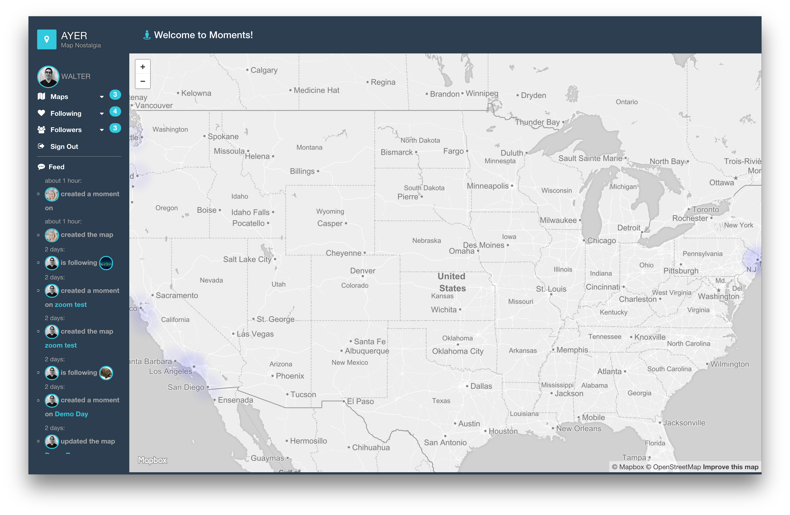
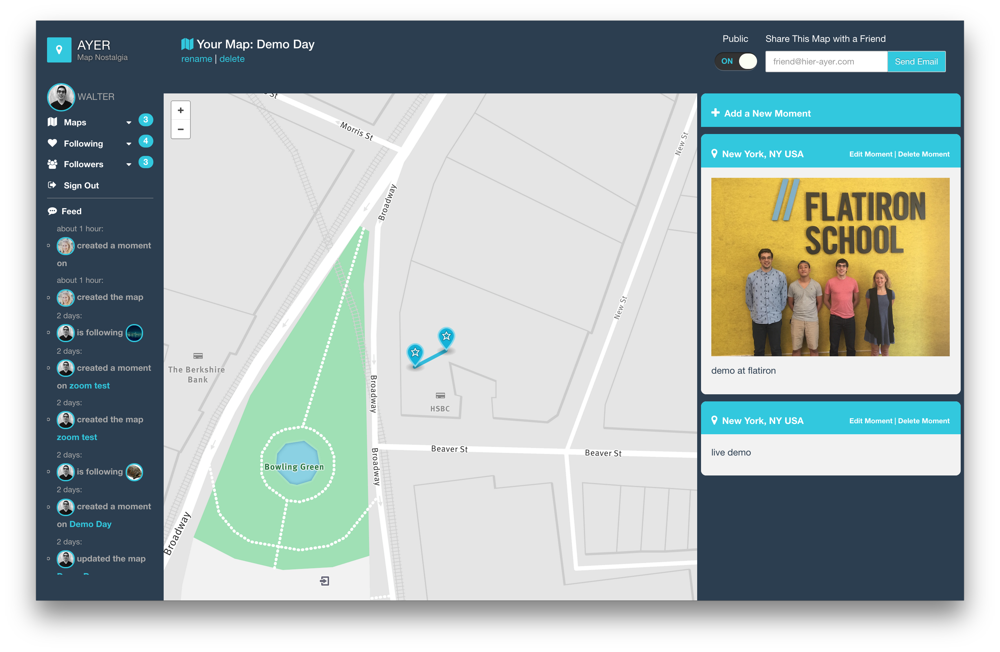

# AYER

## Description

AYER allows you to easily capture moments in your life and visualize them through beautiful maps powered by Mapbox. Simply attach a memo or a photograph to relive those moments. AYER was built with Ruby on Rails and JavaScript and is hosted on Heroku.

## Screenshots

Home page for AYER showing the heat-map of all the moments created by users on the service.

A User's map page showing the moments for this specific trip mapped out with both text memos and images. 

## Background

Social media allows us to connect with far-away friends and family. But the messages, photos, and videos we share are usually uploaded without any geographic information. We developed this application to provide this missing context to our digital memories. 

## Features

+ Flexible and customized dynamic maps power by MapBox.
+ Implements the Devise gem for secure user authentication 
+ Real-time feed of social activity on the site powered by PubNub. 
+ Instagram integration for authentication and to allow users to import photos.
+ PostgresSQL database with a JSON-data column.
+ Bootstrap for a responsive and modular design.

## Usage

Visit [AYER](http://hier-ayer.herokuapp.com/) to sign-up for an account and try-out the app.

## Development/Contribution

Please feel free to contribute to the project. 

## Future

We are working on adding support for Twitter, Facebook, and other social media platforms. We are also improving the process by which users create moments. 

## Authors

Made with &hearts; by // Flatiron School Students:

- [Becca Ades](https://github.com/beccaades)

- [Walter Beller-Morales](https://github.com/walterbm)

- [Ian Hock](https://github.com/iandonovanhock)

- [Ryan Yun](https://github.com/ryannyunn)

## License

AYER is MIT Licensed. See LICENSE for details.